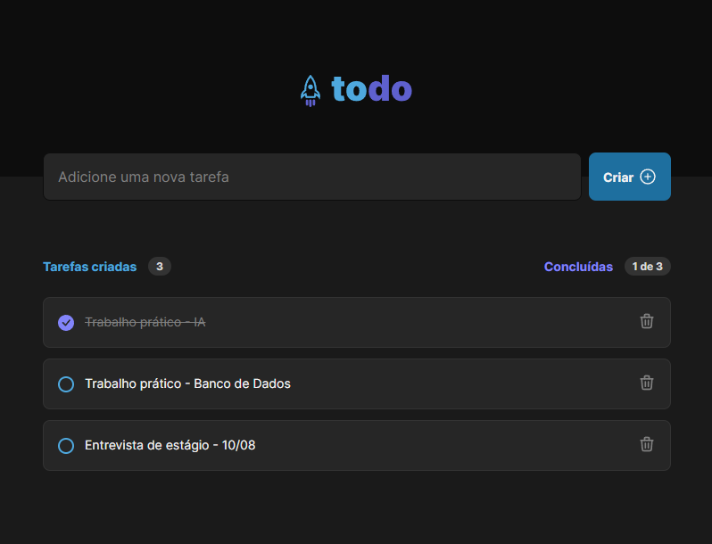

# ToDo List

## Descrição

Um aplicativo simples de lista de tarefas (To-Do List), com funcionalidades de Adicionar, Marcar e Deletar, desenvolvido com ReactJS, com o objetivo de praticar os conceitos fundamentais do framework como estados, imutabilidade, listas e componentização.



## Tecnologias

* React
* Vite
* TypeScript

## Como executar o projeto

1. **Clone o repositório:**
  ```bash
  git clone https://github.com/faelperini/01-todo-list
  ```

2. **Instale as dependências:**
  ```bash
  cd 01-todo-list
  npm install
  ```

3. **Inicie o desenvolvimento:**
  ```Bash
  npm run dev
  ```

O aplicativo será iniciado em http://localhost:5173/

## Funcionalidades

**Adicionar tarefas:** Permite aos usuários inserir novas tarefas na lista.

**Marcar/desmarcar tarefas:** Permite marcar as tarefas como concluídas e desmarcá-las.

**Remover tarefas:** Permite remover tarefas da lista.

**Mostrar progresso:** Exibe um indicador visual do progresso de conclusão das tarefas.